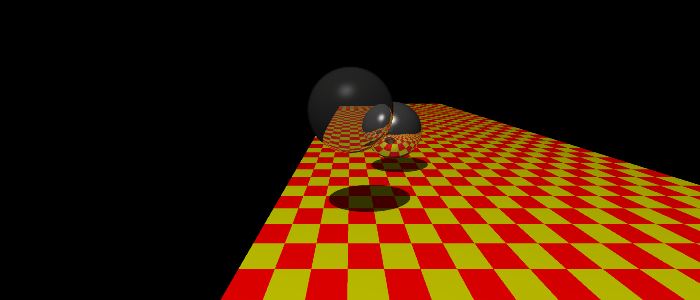
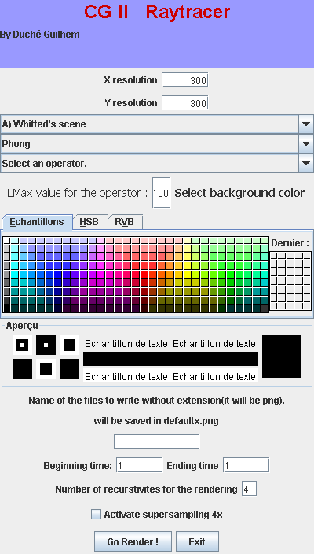
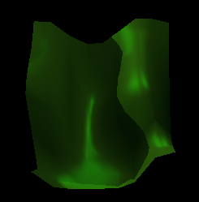
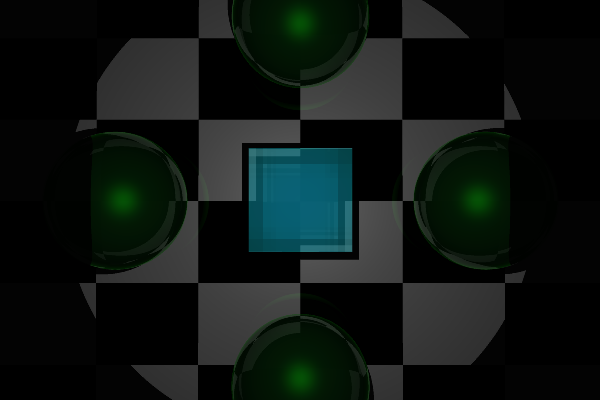
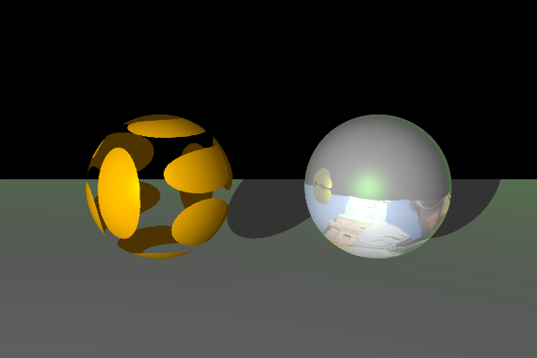
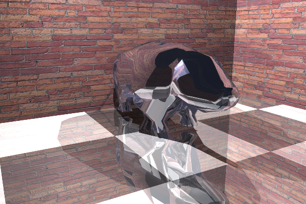
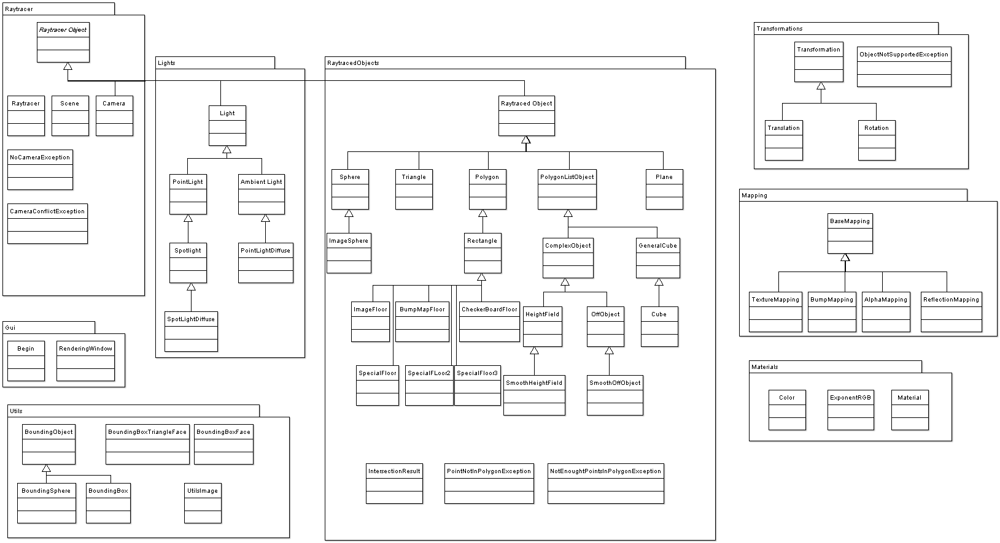

SiJaRay
=======

A simple java raytracer

SiJaRay is simple raytracer fully written in java. 

It supports the following features :
 
- Suppports many differents objects : .off 3D files, Heightfield, BumpMapFloor, CheckerBoard, Cube, Cylinder, Cube, Sphere, Triangle, Plane, ImageFloor, ImageSphere, etc ... 
- Supports different materials and mappings : simple color, AlphaMapping, BumpMapping, TextTureMapping, ReflectionMapping, etc ...
- Supports different kind of lights : Ambien light, Point light, Spot  light, point light diffuse, etc ...
- Some optimizations with bounding objects : bounding sphere, boundingbox. 
- Supports animation using transformations like rotations and translations. Animations are rendered images by images.
- Specific java api to develop your own scenes to render.

The project is pretty simple to handle and has only one dependency : vecmath.jar from java 3D.
You can import this project directly in eclipse.

## Some results :

The gui  :

Some renderings can be seen here :

[Download grosgros](results/grosgros.avi)

[Download anim2](results/anim2.avi)

## Documentation

This project was a bit documented and presented years ago. 

You can find a small documentation here : 

You can find a class diagram here : 

You can find a presentation here : 

## Support
This raytracer was made 8 years ago at the end of my studies when i studied six months at the RIT.
I should have open sourced it years ago but never took the time to release it.
I don't  plan to provide any support neither to update it.
Do not hesitate to modify it, fork it or update it.

License
-------

    Copyright 2014 Guilhem Duché

    Licensed under the Apache License, Version 2.0 (the "License");
    you may not use this file except in compliance with the License.
    You may obtain a copy of the License at

       http://www.apache.org/licenses/LICENSE-2.0

    Unless required by applicable law or agreed to in writing, software
    distributed under the License is distributed on an "AS IS" BASIS,
    WITHOUT WARRANTIES OR CONDITIONS OF ANY KIND, either express or implied.
    See the License for the specific language governing permissions and
    limitations under the License.
